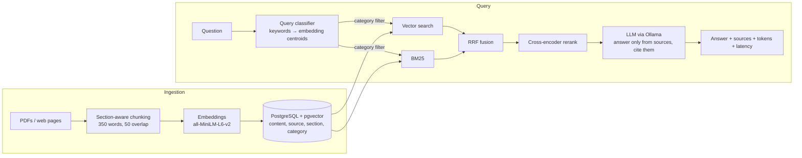

# ContexDex – Enterprise Knowledge RAG System

A small retrieval-augmented generation (RAG) system: it ingests PDFs and web pages, stores chunk embeddings in PostgreSQL + pgvector, retrieves with hybrid search (BM25 + vectors + reranking), and answers questions with cited sources through a Flask API. Runs fully locally and free (Ollama).

## Architecture



## Stack
Python · Flask · PostgreSQL + pgvector · sentence-transformers · rank-bm25 · Ollama (llama3.2:3b, runs locally, free)

## Setup

```bash
# 1. Start Postgres with pgvector
docker compose up -d

# 2. Create a virtual environment and install dependencies
python -m venv venv
venv\Scripts\activate        # Windows  (macOS/Linux: source venv/bin/activate)
pip install -r requirements.txt

# 3. Configure environment
copy .env.example .env       # macOS/Linux: cp .env.example .env

# 4. Check the database connection
python db.py

# 5. Install Ollama (https://ollama.com/download) and pull the model
ollama pull llama3.2:3b
```

## Ingesting documents

- PDFs: put them in `data/<category>/` (e.g. `data/hr/leave-policy.pdf`). The folder name becomes the category.
- Web pages: add `<category> <url>` lines to `data/urls.txt`.

```bash
python ingest.py            # add or refresh sources
python ingest.py --reset    # start from an empty table
```

Each document is split into sections (PDF headings / HTML `h1`-`h3`), then into ~350-word chunks with 50-word overlap. Chunks are embedded with `all-MiniLM-L6-v2` and stored with their source, section and category.

## Retrieval

```bash
python retrieve.py "Can I expense a laptop?"
python retrieve.py "Can I expense a laptop?" --category finance --mode hybrid
```

1. **Vector search**: cosine similarity in pgvector (HNSW index), top 20
2. **BM25**: keyword search over chunk text + section heading, top 20
3. **Reciprocal Rank Fusion**: merges both lists (`score = Σ 1/(60 + rank)`)
4. **Cross-encoder reranking**: `ms-marco-MiniLM-L-6-v2` re-scores the fused candidates and keeps the top k

`--category` restricts every stage to one category (metadata filtering). `--mode vector|bm25|hybrid|rerank` exists so each stage can be compared in evaluation.

## Query classification

```bash
python classify.py "How do I reset my password?"
python retrieve.py "What is my last day process?" --category auto
```

The classifier picks the category so retrieval only searches the relevant documents:

1. **Keyword rules**: if one category's keywords clearly win, use it (fast, explainable).
2. **Embedding fallback**: compare the query with each category's centroid (`AVG(embedding)` in pgvector).
3. **Uncertain**: if the top two categories are within 0.05 similarity, search all categories instead of guessing.

## Answer generation

```bash
python llm.py "Can I expense a laptop?"
```

Runs the full pipeline: classify → hybrid retrieve → rerank → local LLM. The top chunks are numbered `[1]..[n]` in the prompt, and the model must answer only from them, cite the numbers, and reply *"I couldn't find this in the documents."* otherwise. Context is capped at ~1,500 words, and the default top-k is 2 (chosen from the evaluation below). Each answer returns cited sources, token counts and LLM latency.

## REST API

```bash
python app.py        # serves on http://127.0.0.1:5000
```

| Method | Path | Purpose |
|---|---|---|
| GET | `/health` | Checks the database and Ollama are reachable |
| POST | `/ask` | Answers a question |
| POST | `/reload` | Rebuilds the BM25 index and category centroids after `ingest.py` |

`/ask` body: `{"question": "...", "k": 2, "category": "auto", "mode": "rerank"}`. Only `question` is required.

```bash
curl -X POST http://127.0.0.1:5000/ask -H "Content-Type: application/json" -d "{\"question\": \"How much can I spend on books?\"}"
```

Example response:

```json
{
  "question": "How much can I spend on books?",
  "answer": "According to [1] (4.1 NON-TRAVEL RELATED EXPENSES), books are reimbursable if used to optimize your job position, with a limit set to $60 per year.",
  "category": "finance",
  "classified_by": "keywords",
  "sources": [
    {"ref": 1, "section": "4.1 NON-TRAVEL RELATED EXPENSES", "category": "finance",
     "source": "https://handbook.gitlab.com/handbook/finance/expenses/"}
  ],
  "tokens": {"prompt": 1491, "completion": 43},
  "latency_ms": {"retrieval": 1624, "llm": 60165, "total": 61790}
}
```

LLM latency is from `llama3.2:3b` running on a laptop CPU.

## Evaluation

```bash
python eval/run_eval.py          # retrieval metrics (~1 min)
python eval/run_eval.py --llm    # + end-to-end answers at top-k 4 and 2 (~40 min on CPU)
```

Test set: [`eval/questions.json`](eval/questions.json) has 25 hand-written questions, worded differently from the source text. 22 have a known answer (the evidence text that must be retrieved, and the facts the answer must contain); 3 are unanswerable and must be refused. Full output: [`eval/results.md`](eval/results.md).

**Retrieval** (22 answerable questions)

| Configuration | hit@1 | hit@3 | hit@5 | MRR |
|---|---|---|---|---|
| vector only | 73% | 91% | 95% | 0.83 |
| BM25 only | 55% | 91% | 95% | 0.73 |
| hybrid (RRF) | 82% | 95% | 100% | 0.89 |
| hybrid + rerank | 82% | 95% | 100% | 0.90 |
| hybrid + rerank + auto category | 82% | **100%** | 100% | 0.90 |

**End-to-end** (auto category + hybrid + rerank, `llama3.2:3b` on a laptop CPU)

| top-k | answer accuracy | correct refusals | avg tokens / question | median response time |
|---|---|---|---|---|
| 4 | 95% | 3/3 | 1,384 | 48.5 s |
| **2** | **95%** | **3/3** | **728** | **8.7 s** |

Findings:
- Hybrid retrieval puts the right chunk first 82% of the time, vs 73% for vectors alone and 55% for BM25 alone.
- Category filtering never misrouted a question and raised hit@3 to 100%.
- Reranking added little on this small corpus (MRR 0.89 → 0.90) at ~2.3 s CPU cost; it should matter more with a larger corpus.
- Cutting top-k from 4 to 2 used **47% fewer tokens** and answered **~5× faster** with the same accuracy, so k=2 is the default.

Limitations: 22 answerable questions is a small test set (one question = ~4.5 points), and answer accuracy is checked by expected keywords, not by a human or LLM judge.

## Roadmap
- [x] Project setup, Postgres + pgvector
- [x] Ingestion: PDFs/URLs → chunks → embeddings
- [x] Hybrid retrieval (BM25 + vector + RRF) and cross-encoder reranking
- [x] Query classification + metadata filtering
- [x] LLM answer generation with citations
- [x] Flask `/ask` endpoint
- [x] Evaluation (hit@k, latency, token usage)
